# Wellbeing Dashboard

## 🌐 Overview
This project was part of my educational journey at **ENSI** named **"Design and Development Project"**.

It was a fantastic opportunity to dive into web and mobile development, gaining hands-on experience with frontend development using **Flutter** and **Firebase**, as well as UI design using **Figma**.

## 📋 Description
The Wellbeing Dashboard application aims to enhance employee health and well-being, which are crucial for the efficient functioning of a company.
Healthier and happier employees are more productive and satisfied with their work. By providing tools for HR managers and therapists, this application helps companies improve their employees' well-being, leading to reduced absenteeism, turnover, and associated costs.

The application includes:
- A dashboard for HR managers to set well-being goals and visualize overall and departmental well-being metrics.
- An interface for therapists to access employees' personal and emotional data to provide better support.

## 🧰 Tools and Technologies

## 🌟 Features
- **Responsive Design :** Ensures optimal display and functionality across different screens.
- **User Authentication :** Secure login and profile management.
- **Real-Time Data :** Synchronization with Firebase for live updates.
- **Data Visualization :** Insightful and interactive dashboards for HR and therapists.

## 📸 Screenshots

The following screenshots provide a visual overview of the Wellbeing Dashboard application across different screen sizes.

### Large Screens :

Designed for desktop and larger displays, the following screenshots illustrate the comprehensive interfaces available to HR managers and therapists.

- #### Login Screen:
  The initial login screen where therapists or HR managers can securely enter their credentials to access the dashboard.
  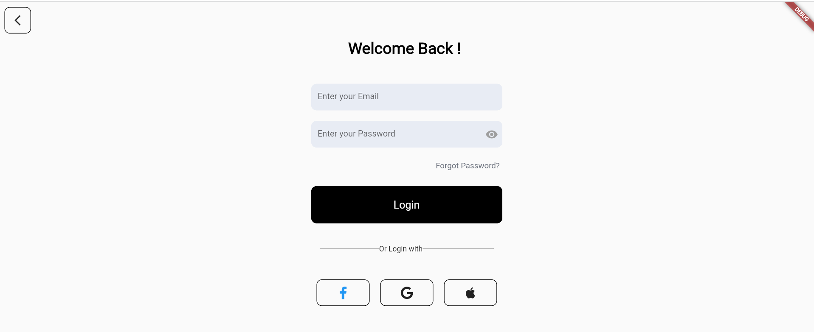

- #### Human Resources Manager Dashboard:
  Provides a detailed view of the employees’ well-being status.

  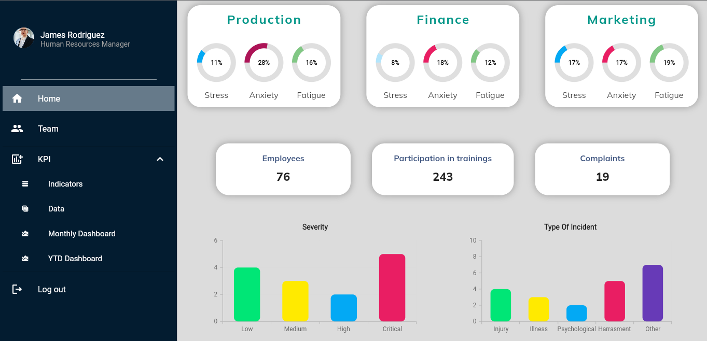
  This screen allows HR managers to view and manage employee data (CRUD operations).

  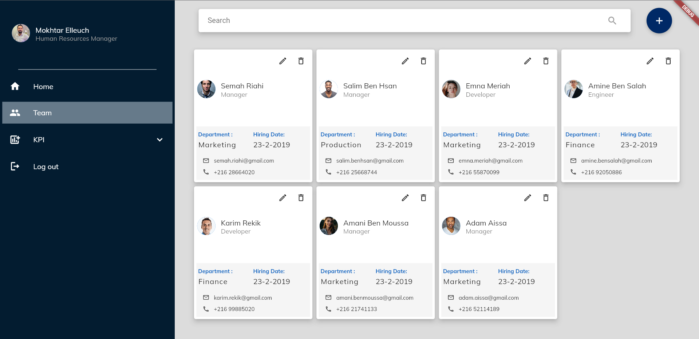

- #### Therapist Interface:
  This interface is tailored for therapists to access and review employee emotional and personal data.
  
  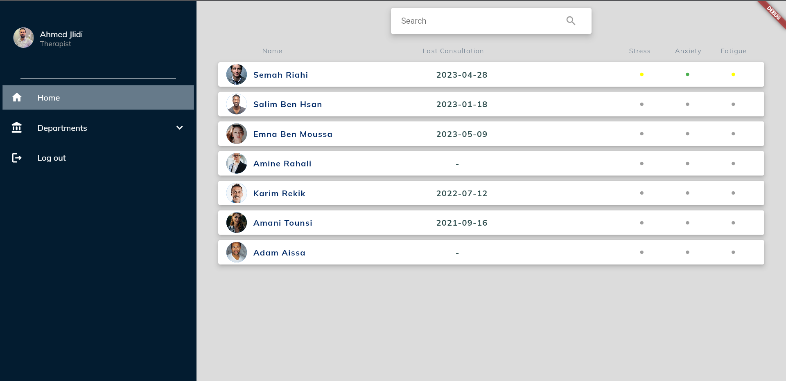
  It allows therapists to manage consultations with employees.
  
  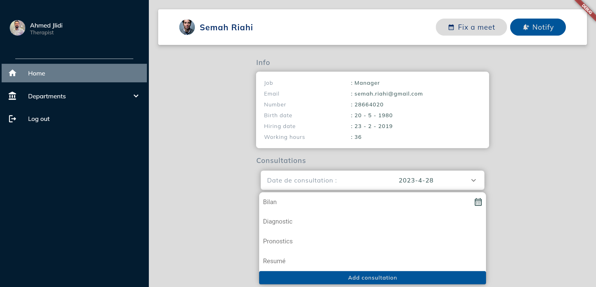

### Medium Screens :

For tablets and mid-sized devices, the following screenshots highlight the adaptive design that maintains functionality and ease of use.

  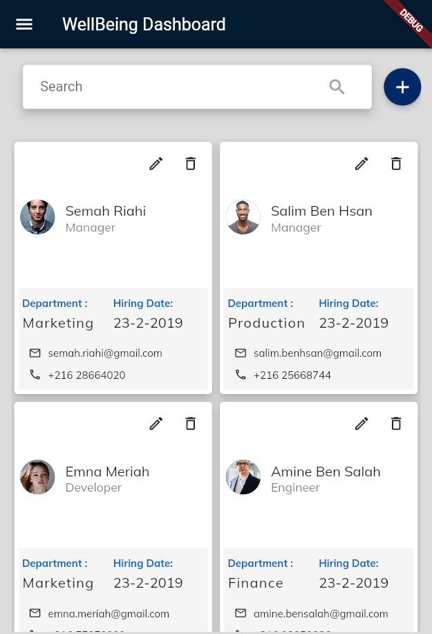
  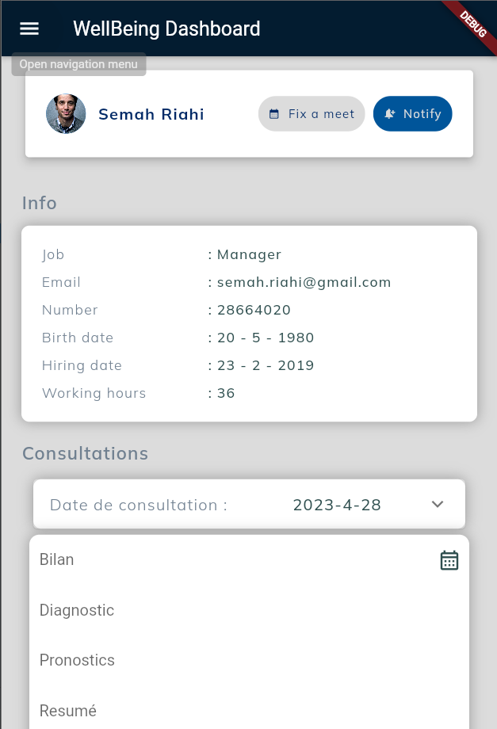
  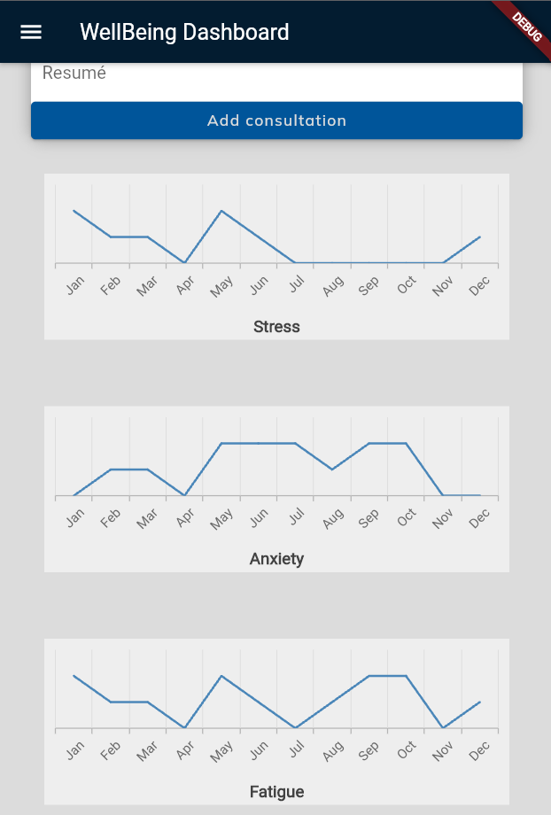

### Small Screens :

Optimized for smartphones, these screenshots ensure the application remains user-friendly and functional on smaller devices.

  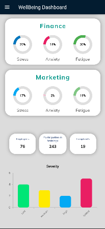
  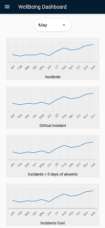
  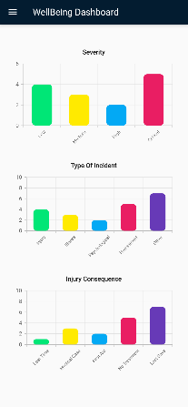

## 🎬 Demo
Experience a walkthrough of the Wellbeing Dashboard application in action. This demo showcases the key features and user interfaces of this application :

